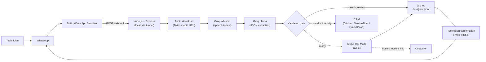
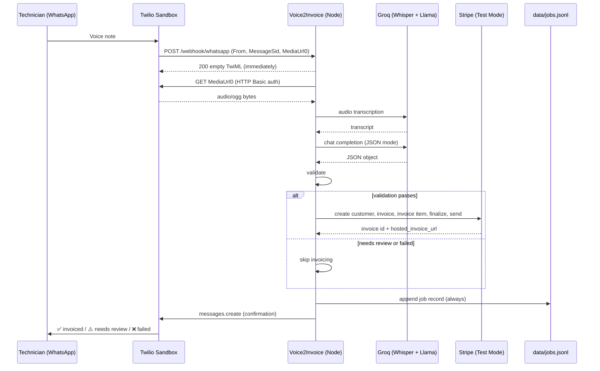
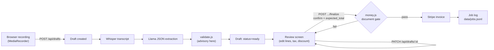

# Voice2Invoice — Architecture

This document describes the smallest credible system that can be demonstrated working in about one hour. Requirements are in `prd.md`, the schedule is in `plan.md`, and build instructions are in `instruction.md`.

---

## 1. High-Level Architecture (MVP)



### Request sequence



---

## 2. Key Implementation Decisions

> **IMPLEMENTATION DECISION: Node.js (Express) instead of Make.com for the MVP.**
> The source suggests Make.com for the demo and Node.js for production. The MVP uses a single small Node.js process instead, for these reasons:
> - An AI coding agent can write, run, and test Node.js directly. A Make.com scenario has to be clicked together by hand in a web UI.
> - The validation gate (§6) is the most important safety feature, and it is much easier to write and unit-test in code than in no-code filters.
> - Each Make.com run uses several operations from the 1,000/month free quota, and repeated testing burns through that quickly.
> - The Node.js code is also the first version of the production backend, so nothing is thrown away.
>
> **Fallback:** if the coding environment is blocked, the same pipeline can be built in Make.com (Webhook → HTTP Get File → Whisper → LLM → Stripe) using the prompt from `instruction.md` §7. The validation gate would then be reduced to Make.com filters.

> **IMPLEMENTATION DECISION: Groq for both speech-to-text and the LLM,** called through the `openai` npm SDK with a custom `baseURL`. Groq's free tier needs no card, and switching to OpenAI (`whisper-1`, `gpt-4o-mini`) only requires changing environment variables.

> **IMPLEMENTATION DECISION: acknowledge the webhook immediately and process asynchronously.** Twilio treats slow webhook responses as errors. The full pipeline (download, transcription, LLM, and four Stripe calls) may take longer than Twilio allows. The server returns an empty TwiML `200` right away and sends the confirmation later through the Twilio REST API.

> **IMPLEMENTATION DECISION: an append-only JSON Lines file (`data/jobs.jsonl`) is the job/compliance log.** The source allows "Sheet or DB". A local file needs no setup, account, or credentials, is easy to read during the demo (`tail -f`), and is naturally append-only.

> **IMPLEMENTATION DECISION: a local tunnel (ngrok, or Cloudflare quick tunnel as fallback)** exposes `localhost` to Twilio. The MVP has no deployment.

---

## 3. Input Layer — Twilio WhatsApp Sandbox

**What it receives:** WhatsApp messages sent to the sandbox number from phones that have joined the sandbox (one-time `join <code>` message).

**Configuration:** Twilio Console → Messaging → Try it out → Send a WhatsApp message → *Sandbox settings* → "When a message comes in" = `https://<tunnel>/webhook/whatsapp`, method `POST`.

**Webhook payload** (`application/x-www-form-urlencoded`). Fields used:

| Field | Use |
|---|---|
| `From` | Technician number, e.g. `whatsapp:+15551234567`. Stored as `technician_number` and used as the reply target. |
| `MessageSid` | Unique message ID. Used for `job_id` and Stripe idempotency keys. |
| `NumMedia` | `0` means a text message. `≥1` means media is attached. |
| `MediaUrl0` | URL of the first attachment (the voice note) |
| `MediaContentType0` | e.g. `audio/ogg`. Must start with `audio/`. |
| `Body` | Text, if any. Used only when `ALLOW_TEXT_INPUT=true`. |

**Media retrieval:** `GET MediaUrl0` with HTTP Basic auth (`TWILIO_ACCOUNT_SID:TWILIO_AUTH_TOKEN`). Twilio may redirect to a pre-signed URL, and Node's `fetch` follows the redirect automatically. WhatsApp voice notes arrive as `audio/ogg` (Opus), which Whisper accepts directly, so **ffmpeg is not needed**.

**Outbound confirmation:** `client.messages.create({ from: TWILIO_WHATSAPP_NUMBER, to: From, body })`. The technician has just messaged, so the reply falls inside WhatsApp's 24-hour session window and free-form text is allowed.

**Signature validation (SHOULD):** `twilio.validateRequest(authToken, X-Twilio-Signature, WEBHOOK_BASE_URL + "/webhook/whatsapp", body)`. It is turned on with `VALIDATE_TWILIO_SIGNATURE=true`. It is off by default in the MVP because a URL mismatch through a tunnel would reject every request and block the demo.

---

## 4. Orchestration Layer — `src/pipeline.js`

One async function runs the stages in order, keeps track of the current stage, and **always** writes a job record and sends a confirmation in a `finally` block.

```text
processVoiceNote
  download (retry 1) → transcribe (retry 1) → empty check
  → processTranscript
       extract (retry 1 on API error or invalid JSON) → validate
       → if ready: createInvoice → status invoiced | invoice_failed
       → else: status needs_review
  finally: appendJob(record); notifyTechnician(record)
```

`processTranscript` is exported separately so local scripts and tests can skip Twilio and audio completely.

---

## 5. Speech Layer — Whisper

```text
audio Buffer (ogg) → Groq /audio/transcriptions (model: TRANSCRIPTION_MODEL) → transcript text
```

- Upload with `toFile(buffer, "voice.ogg", { type: "audio/ogg" })`. The file extension comes from the content type (`ogg`, `mp3`, `m4a`, `wav`, `webm`). Any other type fails with a clear message.
- `temperature: 0`. Language is not set, so Whisper uses its default multilingual detection, as the source specifies.
- Optional `prompt` to steer spelling: `"Field service job note: plumbing, electrical, HVAC. Customer name, parts, hours, amount in dollars."`
- A transcript that is empty or whitespace-only produces `failed` at stage `transcription` ("no speech detected").
- Whisper can produce text from silence or noise (for example, "Thank you."). The validation gate catches this because no customer name will be grounded in the transcript.

---

## 6. Intelligence Layer — LLM Structured Extraction

**Call:** Groq chat completions, `model: EXTRACTION_MODEL`, `temperature: 0`, `response_format: { type: "json_object" }`. The system prompt is in `instruction.md` §7. The transcript is passed as delimited, untrusted data.

**Exact LLM output schema** (all keys must be present):

```json
{
  "customer_name": "string | null",
  "work_performed": "string | null",
  "parts_used": [{ "item": "string", "quantity": "number | null" }],
  "hours_logged": "number | null",
  "amount_to_charge": "number | null",
  "follow_up_required": "boolean",
  "missing_fields": ["customer_name | work_performed | hours_logged | amount_to_charge"],
  "ambiguities": ["string"]
}
```

**Extraction rules** (enforced in the prompt and checked again in validation):
- Extract only information that is explicitly stated.
- Never invent, estimate, or calculate prices. `amount_to_charge` is only a total the technician says out loud.
- Never invent parts or quantities. Parts mentioned for a *future* visit are not `parts_used`.
- Never guess missing values. Use `null` and list the key in `missing_fields`.
- If a value has more than one plausible reading, use `null` and describe it in `ambiguities`.
- Output strict JSON only.

---

## 7. Validation Layer — `src/validate.js` (critical)

This is a pure function with no I/O: `validateExtraction(llmJson, transcript, limits)` → `{ ok, job, blocking[], warnings[] }`.

**Blocking issues mean no invoice.** Warnings are recorded and shown to the technician, but they don't stop the invoice.

| Check | Rule | Result if it fails |
|---|---|---|
| JSON shape | Must be an object with all 8 keys | Blocking |
| `customer_name` | Non-empty string of 100 characters or fewer | Blocking ("customer name not stated") |
| Name grounding | Every word of the name appears as a word in the transcript (case-insensitive) | Blocking. This catches hallucinated names and Whisper noise. |
| `work_performed` | Non-empty string | Blocking. The invoice needs a description. |
| `amount_to_charge` | Present; a number (or a plain numeric string such as `"250"`, which is converted); finite; > 0; ≤ `MAX_INVOICE_AMOUNT`; at most 2 decimals | Blocking |
| Amount grounding | The amount appears as a digit string in the transcript (`$250`, `250`, `1,200`) | **Warning** ("amount not stated as digits — verify"). Spoken shorthand like "two-fifty" is allowed by the source example. |
| `hours_logged` | `null` gives a warning. Otherwise a number with 0 < hours ≤ `MAX_HOURS_LOGGED`. | Invalid value is blocking. `null` is a warning. |
| `parts_used` | Must be an array | Blocking |
| Part entries | `item` is a non-empty string. `quantity` is `null` or > 0 (an invalid quantity becomes `null` with a warning). | Malformed entry is dropped, with a warning |
| Part grounding | At least one word (3+ letters, trailing "s" ignored) from `item` appears in the transcript | Part is **dropped**, with a warning (hallucination guard). Parts never affect the amount. |
| `follow_up_required` | Boolean | Non-boolean becomes `false`, with a warning |
| `ambiguities` | Must be an array. **Any entry blocks the invoice.** | Blocking |
| `missing_fields` | Must be an array. If it lists `amount_to_charge` or `customer_name` while that field has a value, the output contradicts itself. | Blocking |

Result: `blocking.length === 0` gives `ok: true` and the invoice proceeds. Otherwise the status is `needs_review`.

---

## 8. Invoice Layer — Stripe Test Mode (`src/invoice.js`)

```text
Customer → Invoice (draft) → Invoice Item (attached to invoice) → Finalize → Send (best-effort)
```

1. `customers.create({ name, email?: DEMO_CUSTOMER_EMAIL, metadata: { job_id, technician_number } })`
2. `invoices.create({ customer, collection_method: "send_invoice", days_until_due, currency, auto_advance: false, description, metadata })`
3. `invoiceItems.create({ customer, invoice: invoice.id, amount: round(amount × 100), currency, description: work_performed })`
   The item is attached explicitly to the invoice, so behavior doesn't depend on how the Stripe API version handles pending invoice items.
4. `invoices.finalizeInvoice(id)` returns `hosted_invoice_url` and `number`.
5. If `DEMO_CUSTOMER_EMAIL` is set, call `invoices.sendInvoice(id)`. A failure sets `send_status: "send_failed"` and does **not** fail the job.

**Rules**
- **One line item** equal to `amount_to_charge`. Parts and hours go into the invoice `description` as text, never as priced lines.
- **No real payments.** On startup, the server refuses any key that does not start with `sk_test_` or `rk_test_`.
- **Idempotency (SHOULD):** each call passes `idempotencyKey: "<job_id>-<step>"`.
- **IMPLEMENTATION DECISION:** a new Stripe customer is created for every job. Finding an existing customer is a SHOULD.
- Don't rely on Stripe emails in the demo. The hosted invoice link sent to the technician is the proof.
- The code assumes a 2-decimal currency (`usd` by default; `inr` also works). Zero-decimal currencies are not supported in the MVP.

---

## 9. Persistence — `data/jobs.jsonl`

Each processed message appends exactly one line:

```json
{
  "job_id": "job_SM0123456789abcdef",
  "status": "invoiced",
  "failed_stage": null,
  "customer_name": "Bob Vance",
  "work_performed": "Replaced water heater",
  "parts_used": [{ "item": "50-gallon water heater unit", "quantity": 1 }, { "item": "fittings", "quantity": 2 }],
  "hours_logged": 2,
  "amount_to_charge": 250,
  "follow_up_required": false,
  "technician_number": "whatsapp:+15551234567",
  "timestamp": "2026-09-15T10:32:05.000Z",
  "transcript_raw": "Just replaced the water heater for Bob Vance, used one 50-gallon unit and two fittings, took about two hours, charge two-fifty.",
  "message_sid": "SM0123456789abcdef",
  "validation": { "blocking": [], "warnings": ["amount not stated as digits in transcript — verify"] },
  "llm_output_raw": "{...}",
  "stripe": { "customer_id": "cus_...", "invoice_id": "in_...", "invoice_number": "ABCD-0001", "hosted_invoice_url": "https://invoice.stripe.com/...", "send_status": "sent" },
  "error": null,
  "processing_ms": 6840
}
```

- `transcript_raw` is **always** stored when a transcript exists. It is the audit and dispute record.
- Nothing is updated or deleted. A corrected job is a new line.
- Audio is **not** stored, which minimizes sensitive data.
- `data/` is git-ignored.

---

## 9b. In-app review flow — `src/draftflow.js`, `src/drafts.js`, `src/money.js`

The WhatsApp path has to decide on its own whether to bill, so its gate is strict and
its invoice is one line. The in-app path has a person present, so the design is inverted:
the pipeline proposes, the human disposes.



**Same pipeline, different ending.** Transcription, extraction, and `validate.js` are
literally the same modules. What changes is that a blocking validation result no longer
kills the job — it becomes an advisory flag on the review screen for a human to resolve.
The real gate moves to `validateInvoiceDocument()` in `src/money.js`, which runs at send
time against the document the person actually approved.

**The model still never prices anything.** The draft it produces carries exactly one line
item, priced at the total the technician said out loud, and a list of parts it heard named
but deliberately left unpriced. Every other number on the finished invoice is typed by a
person.

**Drafts are not job records.** A job record is append-only history; a draft is a mutable
working document, so it lives in `data/drafts.json` instead. A draft becomes a job record
only at the moment it is finalized, which keeps `data/jobs.jsonl` the single audit trail
for both entry points. Finalized web jobs carry `source: "web"` and an extra
`invoice_document` field holding the approved line items and totals.

**Money is integer cents.** `src/money.js` computes every total in cents and rounds once
per line, so 2.5 hours at 90.00 is a single well-defined value rather than an accumulating
float error. Tax applies after the discount; a discount can never push a total below zero.
`web/src/lib/money.ts` mirrors the same arithmetic so the editor can show live totals, but
it is a display convenience only — the server recomputes from the line items on every
request and refuses to send if the two disagree.

### The four write routes

These are the only non-`GET` routes in the application.

| Route | Reaches Stripe? | Guard |
|---|---|---|
| `POST /api/drafts` | No | Content-type allow-list, 25 MB cap |
| `POST /api/drafts/blank` | No | Creates an empty draft; unsendable until filled in |
| `PATCH /api/drafts/:id` | No | Whitelisted fields only; client totals ignored |
| `DELETE /api/drafts/:id` | No | — |
| `POST /api/jobs/:id/draft` | No | Refuses if the job already has an invoice; reuses an in-progress draft |
| `POST /api/drafts/:id/finalize` | **Yes** | Four checks below |

**The rescue path.** `POST /api/jobs/:id/draft` rebuilds a job the automatic gate
refused into a reviewable draft, so a blocked voice note does not have to be
re-recorded. It copies the stored transcript, customer, work and parts, keeps the
original blocking reasons as advisory flags, and — critically — carries no price
unless one was actually spoken. It creates nothing in Stripe; the draft goes
through `finalize` like any other.

`finalize` refuses unless: an explicit `confirm: true` is present; the document passes
`validateInvoiceDocument()`; the `expected_total` the reviewer saw equals the server's own
computed total (a `409`, not a silent correction); and the draft has not already been
invoiced. Stripe's finalized total is then compared against ours and a mismatch is recorded
on the job rather than passed over.

---

## 10. CRM — deferred

The CRM is not part of the 1-hour MVP. The job record already has every field a write-only CRM push needs. In production, add `src/crm.js` with one adapter per system (Jobber, ServiceTitan, QuickBooks), called **after** the job record is written. A CRM failure must never block or undo the invoice. It should be recorded and retried.

---

## 11. Error Handling

| Failure | Detection | Behavior | Job record | Technician message |
|---|---|---|---|---|
| **Twilio can't reach the webhook** | Nothing arrives. Twilio Console → Monitor → Errors shows the error. | Check the tunnel URL, the sandbox webhook URL, and that the server is running. Switch to the Cloudflare tunnel if needed. | None | None |
| **Invalid signature** (validation on) | `validateRequest` returns false | `403`, no processing | None | None |
| **Non-audio message** | `NumMedia=0` or type isn't `audio/*` | Reply only, unless `ALLOW_TEXT_INPUT` is on | None | "Please send a voice note…" |
| **Audio download fails** | Non-2xx response or network error | Retry once, then stop | `failed` / `download` | ❌ "Couldn't fetch your voice note, please resend." |
| **Transcription fails or is empty** | API error or blank text | Retry once on API error, then stop | `failed` / `transcription` | ❌ "Couldn't transcribe, please resend." |
| **LLM API fails** | API error | Retry once, then stop | `failed` / `extraction`, transcript kept | ❌ "Couldn't read the job details, please resend." |
| **Invalid JSON** | `JSON.parse` fails after removing code fences | Retry once, then stop | `failed` / `extraction`, raw output kept | ❌ same as above |
| **Missing or ambiguous amount, or other blocking issue** | Validation | **No invoice** | `needs_review` + reasons | ⚠️ "Not invoiced — amount not stated. Resend with customer and amount." |
| **Stripe fails** | API error | No retry beyond the SDK default. Record any Stripe IDs already created (a draft may exist). | `invoice_failed` + error | ⚠️ "Job recorded, invoice NOT created — office will follow up." |
| **Stripe send fails** | `sendInvoice` error | Invoice stays finalized and the link still works | `invoiced`, `send_status: send_failed` | ✅ with the link |
| **CRM fails** (production) | Adapter error | Record and retry later; the invoice is unaffected | Adds `crm_status` | None |
| **Confirmation send fails** | Twilio REST error | Log to console only | Unchanged | None |
| **Job log write fails** | fs error | Log to console with the full record as JSON so it isn't lost | None | Sent anyway |

---

## 12. Security (MVP)

- All secrets come from environment variables (`.env`, loaded with `dotenv`). `.env` is git-ignored, and only `.env.example` with empty values is committed.
- Secrets are never logged, printed, sent to the LLM, or written to the job log.
- Stripe runs in test mode only; the startup guard rejects live keys. A restricted key is preferred (Customers + Invoices write).
- Audio is not stored. Job log fields are limited to the schema.
- The transcript is passed to the LLM as delimited, untrusted data, and the prompt says to ignore any instructions inside it.
- Job history is read-only over HTTP. The only write routes are the four `/api/drafts` routes used by the review flow, and only `finalize` can reach Stripe — behind explicit human confirmation, server-side document validation, and a total that must match what the reviewer saw.
- Uploaded audio is capped at 25 MB and restricted to an audio content-type allow-list. It is transcribed in memory and never written to disk.
- Draft edits are whitelisted field by field; the browser cannot inject arbitrary keys, and a total sent by the browser is never trusted as a total.
- These routes are unauthenticated, which is acceptable for a single-operator local tool but is the first thing that must change before exposing the dashboard beyond localhost. The public tunnel should expose `/webhook/whatsapp` only.
- Twilio signature validation is available and should be turned on once the tunnel URL is stable.

---

## 13. MVP vs Production

| Concern | MVP (1 hour) | Production |
|---|---|---|
| Channel | Twilio WhatsApp Sandbox | Twilio WhatsApp Business API with an approved sender |
| Hosting | Local Node.js process + ngrok or Cloudflare tunnel | Deployed Node.js service with a stable HTTPS URL |
| Processing | In-process async after an immediate acknowledgment | Job queue with retries, backoff, and dead-letter handling |
| Speech / LLM | Groq free tier | Paid tier, reviewed data-processing terms, and an eval suite |
| Validation | Rules + grounding checks | Same, plus confirm-before-send with a 60-second edit window |
| Invoicing | Stripe Test Mode, one line item | Live Stripe after KYC, or QuickBooks; customer matching; tax |
| Storage | `data/jobs.jsonl` | Postgres (or similar) with an append-only audit table and retention policy |
| CRM | None | Write-only adapters for Jobber, ServiceTitan, and QuickBooks |
| Auth / tenancy | None (single business) | Per-business accounts, technician allow-list, admin dashboard |
| Security | Env vars; optional signature check | Secrets manager, mandatory signature validation, rate limiting, PII review |
